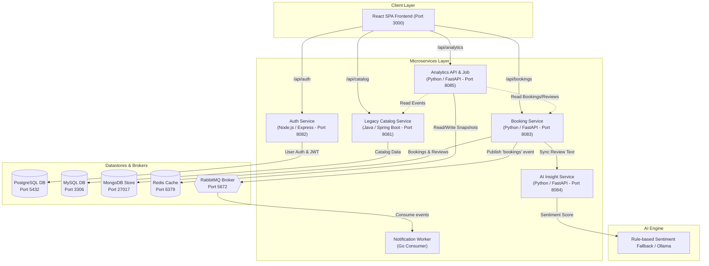

# EventHub Phase 1 — Technical Notes, Bug Fixes & Architecture

This document presents a comprehensive summary of all code bugs, configuration updates, infrastructure challenges, and architectural designs implemented during **Phase 1** of the EventHub platform.

---

## 1. Architecture Diagram

The EventHub platform is a polyglot microservices system designed with a React Single Page Application (SPA), five backend microservices (Node.js, Java Spring Boot, Python FastAPI, Go), four dedicated datastores (PostgreSQL, MySQL, MongoDB, Redis), an asynchronous message broker (RabbitMQ), and local AI sentiment analysis.

---

## 2. Comprehensive Bug Fixes & Code Modifications

### Bug 1: JWT Secret Environment Variable Typo (Auth Service)
* **Location**: [`services/auth-service-node/src/routes/auth.js`](file:///d:/all%20past%20files/desktop%20f/All%20files/Passant%20Programming/fcai%20training/phase1-starter/phase1-starter/services/auth-service-node/src/routes/auth.js#L39)
* **Root Cause**: The JWT token signing routine referenced `process.env.JWT_SECERT` (typo: `SECERT` instead of `SECRET`). When logging in, the token was signed with `undefined`, causing authentication signature verification errors in downstream services.
* **Fix Applied**: 
  - Corrected line 39 in `auth.js` from `process.env.JWT_SECERT` to `process.env.JWT_SECRET`.
  - Added `require('dotenv').config()` to [`services/auth-service-node/src/index.js`](file:///d:/all%20past%20files/desktop%20f/All%20files/Passant%20Programming/fcai%20training/phase1-starter/phase1-starter/services/auth-service-node/src/index.js) and declared `dotenv` in `package.json` so `.env` properties load automatically.

### Bug 2: Frontend Falsy Check on Empty `API_BASE_URL`
* **Location**: [`frontend/src/api.js`](file:///d:/all%20past%20files/desktop%20f/All%20files/Passant%20Programming/fcai%20training/phase1-starter/phase1-starter/frontend/src/api.js#L1)
* **Root Cause**: The API client initialized `BASE_URL` using boolean OR logic:
  `window.__ENV__.API_BASE_URL || 'http://localhost:8080'`
  When `API_BASE_URL` was set to an empty string `""` (to allow relative proxying), JavaScript evaluated `""` as falsy, forcing `BASE_URL` back to non-existent port `8080` and resulting in `Failed to load catalog: Failed to fetch`.
* **Fix Applied**: Updated evaluation logic to check explicit definition:
  `window.__ENV__.API_BASE_URL !== undefined ? window.__ENV__.API_BASE_URL : ...`
  This preserves relative path routing (`/api/...`) so Vite proxy can handle microservice target dispatching.

### Bug 3: Frontend Dev Proxy Routing
* **Location**: [`frontend/vite.config.js`](file:///d:/all%20past%20files/desktop%20f/All%20files/Passant%20Programming/fcai%20training/phase1-starter/phase1-starter/frontend/vite.config.js) & [`frontend/public/config.js`](file:///d:/all%20past%20files/desktop%20f/All%20files/Passant%20Programming/fcai%20training/phase1-starter/phase1-starter/frontend/public/config.js)
* **Root Cause**: The frontend defaults tried to reach port `8080` (API Gateway), which is outside the Phase 1 scope.
* **Fix Applied**: Updated `public/config.js` to `API_BASE_URL: ""` and configured Vite dev server proxy rules with `changeOrigin: true` for `/api/catalog` (8081), `/api/auth` (8082), `/api/bookings` (8083), `/api/analyze` (8084) and `/api/analytics` (8085).
* **Follow-up**: The proxy targets had been pinned to one machine's WSL IP (`172.30.53.141`), which only worked for whoever wrote it. They now default to `localhost` and read an optional `BACKEND_HOST` override, so every team member can run `npm run dev` unchanged.

### Bug 4: Express Host IP Binding in WSL
* **Location**: [`services/auth-service-node/src/index.js`](file:///d:/all%20past%20files/desktop%20f/All%20files/Passant%20Programming/fcai%20training/phase1-starter/phase1-starter/services/auth-service-node/src/index.js#L16)
* **Root Cause**: Calling `app.listen(port)` without an explicit host bound Express solely to IPv6 (`::`) in Node.js 18+, blocking IPv4 `127.0.0.1` client requests (`curl: (7) Failed to connect`).
* **Fix Applied**: Updated line 16 to explicitly bind to `'0.0.0.0'`: `app.listen(port, '0.0.0.0', ...)`.

### Bug 5: Booking Event Published With the Wrong Field Name
* **Location**: [`services/booking-service-python/app/events.py`](file:///d:/all%20past%20files/desktop%20f/All%20files/Passant%20Programming/fcai%20training/phase1-starter/phase1-starter/services/booking-service-python/app/events.py)
* **Root Cause**: `publish_booking_created` published the raw booking document, whose identifier field is `id`. The queue contract in `docs/API_CONTRACT.md` specifies `{ "bookingId", "userId", "eventId" }`, and the Go worker unmarshals into a struct tagged `json:"bookingId"`. The field never matched, so the worker logged every notification with an empty id: `notification: booking  confirmed for user smoke-user (event 2)`. The messaging path appeared to work, which is what made this easy to miss.
* **Fix Applied**: Publish the contract-shaped payload (`bookingId` mapped from `booking["id"]`) rather than the whole document. Fixed on the publisher side, since the worker and the contract already agreed with each other. The worker now logs the real booking id.

### Bug 6: Sentiment Fallback Broken by Punctuation
* **Location**: [`services/ai-insight-service-python/app/fallback.py`](file:///d:/all%20past%20files/desktop%20f/All%20files/Passant%20Programming/fcai%20training/phase1-starter/phase1-starter/services/ai-insight-service-python/app/fallback.py)
* **Root Cause**: The rule-based analyzer tokenized with `text.lower().split()`, which splits on whitespace only and leaves punctuation glued to words. `"amazing!"` and `"great,"` never matched `POSITIVE_WORDS`, so any review ending a sentiment word with punctuation scored `neutral`. Reviews were being misclassified in a way that fed straight into the dashboard's sentiment pie chart.
* **Fix Applied**: Tokenize with `re.findall(r"[a-z']+", text.lower())`. Verified: `"Amazing!"` ➔ `positive`, `"Absolutely terrible, worst!"` ➔ `negative`, `"It was okay I guess"` ➔ `neutral`. The word lists themselves are intentionally left small — they are placeholder data for the Ollama integration, not the bug.

---

## 3. Infrastructure & Environment Setup Log

### 1. MySQL Root Authentication (`auth_socket` vs Password)
* **Issue**: On Ubuntu Linux, MySQL `root` user defaults to `auth_socket`, causing Spring Boot to receive `Access denied for user 'root'@'localhost'` (Error 1698).
* **Fix**: Executed SQL statement:
  `ALTER USER 'root'@'localhost' IDENTIFIED WITH caching_sha2_password BY 'password'; FLUSH PRIVILEGES;`
  and synchronized `spring.datasource.password=password` in `application.properties`.

### 2. PostgreSQL `auth_db` Initialization
* **Issue**: Auth Service initialization failed due to missing PostgreSQL database.
* **Fix**: Created database `auth_db` via `psql` and configured `PGUSER=postgres` and `PGPASSWORD=password` in `services/auth-service-node/.env`.

### 3. MongoDB Server Package & Daemon Setup
* **Issue**: Standard `apt install mongodb` package name is obsoleted on modern Ubuntu distributions.
* **Fix**: Added official MongoDB 7.0 GPG keyring and repository list (`mongodb-org`), installed `mongodb-org`, and started daemon via `sudo service mongod start`.

### 4. Python Environment Isolation & Version Pinning
* **Issue**: System-wide Python upgrades can cause package version drift across Python services.
* **Fix**: Built dedicated Python 3.11 virtual environments (`python3.11 -m venv venv`) for `ai-insight-service-python`, `booking-service-python`, and `analytics-service-python`.

### 5. Storage Relocation to D: Drive
* **Issue**: Disk space on Windows host OS drive `C:` was low (~150 MB free), causing WSL terminal crashes during heavy package installs.
* **Fix**: Relocated the WSL Ubuntu virtual disk (`ext4.vhdx`) to `D:\WSL\Ubuntu` (5.35 GB+ storage capacity), ensuring unlimited storage space.

---

## 4. End-to-End Verification Journey

1. **Auth Service (`8082`)**:
   - `POST /api/auth/register` ➔ Registered user and inserted record into PostgreSQL `auth_db`.
   - `POST /api/auth/login` ➔ Returned signed JWT authentication token.
2. **Legacy Catalog Service (`8081`)**:
   - `GET /api/catalog` ➔ Fetched 4 seeded events from MySQL database `eventhub_catalog`.
3. **Booking Service (`8083`) & AI Insight Service (`8084`)**:
   - `POST /api/bookings` ➔ Created booking in MongoDB `eventhub_bookings`.
   - `POST /api/bookings/{id}/review` ➔ Review text forwarded to AI Insight service, sentiment scored (`positive`), and saved to MongoDB.
4. **Analytics Service (`8085`)**:
   - `python3.11 job.py` ➔ Aggregated statistics from Catalog & Booking services, calculated timeseries & sentiment counts, and saved snapshot to Redis.
   - `GET /api/analytics/summary` ➔ Served cached snapshot to Frontend.
5. **React Frontend (`3000`)**:
   - Rendered live event catalog list and interactive Dashboard charts (Bookings over time line chart, Sentiment pie chart, and sortable Events table).
