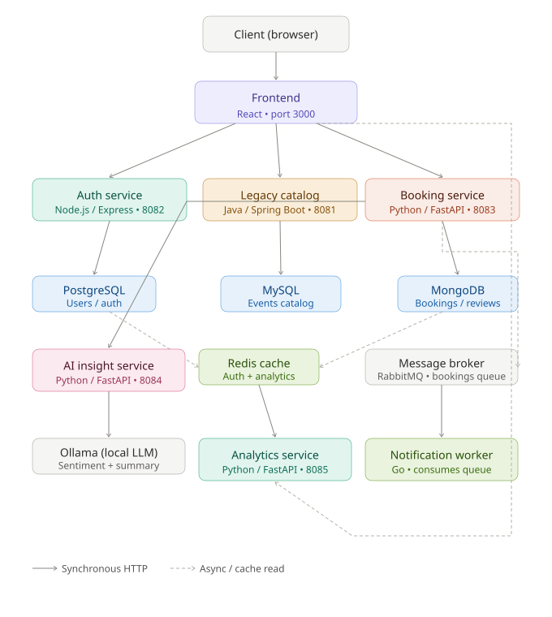

# EventHub

Polyglot microservices platform for campus event booking: register, browse a catalog, book a seat, receive an async notification, review with sentiment, and watch a live analytics dashboard.

The UI talks only to the frontend. Nginx routes `/api/*` to the services behind it — the same shape locally (Compose / Podman) and on OpenShift (one public Route).

<p align="center">
  
</p>

## Features

- JWT auth (register / login) against PostgreSQL
- Event catalog from a Spring Boot “legacy” service on MySQL
- Bookings and reviews in MongoDB
- Async booking notifications over RabbitMQ (Go consumer)
- Review sentiment via a local LLM (Ollama) with a rule-based fallback
- Analytics snapshot job → Redis → dashboard (charts + sortable table)

## Architecture

```
Browser
  → Frontend (React + Nginx)
       → Catalog (Java / Spring Boot)  → MySQL
       → Auth (Node.js / Express)      → PostgreSQL
       → Booking (Python / FastAPI)    → MongoDB
            → publishes → RabbitMQ → Notification worker (Go)
            → calls     → AI Insight (Python) → Ollama or fallback
       → Analytics API (Python)        → Redis  (written by job.py)
```

| Service | Stack | Port |
|---|---|---|
| `frontend` | React, Nginx | 3000 → 8080 |
| `legacy-catalog` | Java 8, Spring Boot | 8081 |
| `auth-service` | Node.js, Express | 8082 |
| `booking-service` | Python, FastAPI | 8083 |
| `ai-insight` | Python, FastAPI | 8084 |
| `analytics-api` | Python, FastAPI | 8085 |
| `notification-worker` | Go | (consumer only) |
| `analytics` job | same image as the API | runs `python job.py`, then exits |

Two paths that are easy to miss:

- **Notification** is async: book → Mongo → RabbitMQ → worker logs. The booker does not wait.
- **Dashboard** is a **snapshot**: `job.py` aggregates catalog, bookings, and reviews into Redis. The API only reads that snapshot.

Stable HTTP shapes live in [`docs/API_CONTRACT.md`](docs/API_CONTRACT.md). Design notes: [`docs/ARCHITECTURE.md`](docs/ARCHITECTURE.md).

## Quick start (Docker Compose)

Requires Docker (or Podman with Compose). From the repo root:

```bash
cp .env.example .env
# Docker Desktop: set DNS_RESOLVER=127.0.0.11 in .env
docker compose up --build
```

Open [http://localhost:3000](http://localhost:3000).

Ollama is optional. If it is not running, reviews still get sentiment from the fallback — the contract stays the same.

Smoke the full journey (after the stack is up):

```bash
bash infra/scripts/smoke-test.sh
```

## Run with Podman (no Compose)

```bash
bash infra/scripts/run-all.sh
```

Builds every `Containerfile`, starts infrastructure and services on `eventhub-net`, seeds MySQL and MongoDB, then runs the analytics job once. Notes from that work: [`infra/scripts/NOTES.md`](infra/scripts/NOTES.md).

## OpenShift

Images build from each service `Containerfile`. Workloads:

| Kind | What |
|---|---|
| Deployment / DeploymentConfig | Long-running services and datastores |
| Job / CronJob | `python job.py` (not a Deployment — it is meant to exit) |
| Service | Cluster DNS names must match nginx (`legacy-catalog`, `auth-service`, …) |
| Route | **Frontend only** — public HTTPS URL |

OpenShift runs as a random non-root UID, so the frontend listens on **8080**. Nginx `resolver` does not use Kubernetes search domains; upstreams need the FQDN `<service>.<namespace>.svc.cluster.local` (see `infra/openshift/`). Wrapper images for Mongo and RabbitMQ live there too.

Helpers: [`infra/openshift/deploy.sh`](infra/openshift/deploy.sh).

## Repository layout

```
frontend/          React SPA + Nginx reverse proxy
services/          One folder per microservice + Containerfile
db-seed/           MySQL and MongoDB seed data
docs/              Architecture, API contract, diagram
infra/scripts/     Podman run-all + smoke test
infra/openshift/   SCC-safe images and cluster deploy script
```

## How this was built

Taken from a running laptop all the way to a public OpenShift Route:

1. **Native runtimes** — understand each service and the API contract  
2. **Podman by hand** — images, network, health, seed, job vs service  
3. **Compose** — the same graph, declared  
4. **OpenShift (ROSA)** — BuildConfigs, Services, Route, CronJob for snapshots  

Debugging write-up from bringing the stack up: [`PHASE1_NOTES.md`](PHASE1_NOTES.md).

## License

[MIT](LICENSE)
